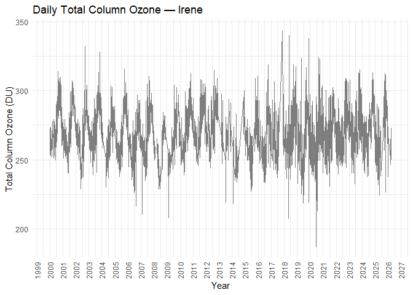
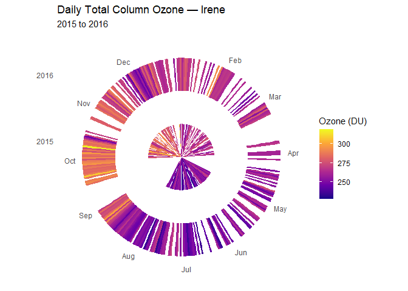

<!-- README.md is generated from README.Rmd. Please edit that file -->

# ozoneexplorer

<!-- badges: start -->

<!-- badges: end -->

`ozoneexplorer` provides tools for exploring ozone data retrieved from
the World Ozone and Ultraviolet Radiation Data Centre (WOUDC). The
package provides access to ozone observations together with station,
contributor, instrument, and observation metadata. It is designed to
facilitate exploratory analysis and visualization of ozone data across
stations and time.

## Installation

You can install the development version of ozoneexplorer from
[GitHub](https://github.com/) with:

``` r
# install.packages("pak")
pak::pak("thiyangt/ozoneexplorer")
```

## Example

This is a basic example which shows you how to load a dataset:

``` r
library(ozoneexplorer)
data(ozonedata)
```

``` r
library(tidyverse)
irene <- ozonedata |>
  filter(station_name == "Irene") |>
  mutate(
    daily_date = as.Date(daily_date),
    daily_columno3 = as.numeric(daily_columno3)
  ) |>
  filter(
    !is.na(daily_date),
    !is.na(daily_columno3)
  )

ggplot(irene, aes(x = daily_date, y = daily_columno3)) +
  geom_line(alpha = 0.5) +
  labs(
    title = "Daily Total Column Ozone — Irene",
    x = "Year",
    y = "Total Column Ozone (DU)"
  ) +
  scale_x_date(
    date_breaks = "1 year",
    date_labels = "%Y"
  ) +
  theme_minimal() +
  theme(
    axis.text.x = element_text(angle = 90, vjust = 0.5)
  )
```



## Spiral Time Series Plot

``` r
spiral_ozone(
  ozonedata,
   station = "Irene",
   years = 2015:2016,
   ring_spacing = 2
 )
```



## Data attribution and citation

The ozone data provided by `ozoneexplorer` are retrieved from the World
Ozone and Ultraviolet Radiation Data Centre (WOUDC).

When publishing data retrieved from WOUDC, users are expected to
acknowledge the contributors who author these data as the data source
and WOUDC, using the appropriate citation.

For data originating from a large number of organizations, WOUDC
recommends the following citations:

> WMO/GAW Ozone Monitoring Community, World Meteorological Organization-
> Global Atmosphere Watch Program (WMO-GAW)/World Ozone and Ultraviolet
> Radiation Data Centre (WOUDC) \[Data\]. Retrieved \[date\], from
> <https://woudc.org>. A list of all contributors is available on the
> website. <doi:10.14287/10000001>

> WMO/GAW UV Radiation Monitoring Community, World Meteorological
> Organization- Global Atmosphere Watch Program (WMO-GAW)/World Ozone
> and Ultraviolet Radiation Data Centre (WOUDC) \[Data\]. Retrieved
> \[date\], from <https://woudc.org>. A list of all contributors is
> available on the website. <doi:10.14287/10000002>

A complete list of contributors is available from the [WOUDC contributor
list](https://www.woudc.org/en/contributors).

### Citation of products derived from WOUDC

When publishing products extracted from WOUDC, such as graphs, lists,
maps, or metadata, users are expected to acknowledge WOUDC as the data
and product source.

> Environment and Climate Change Canada, Toronto (n.d.). World
> Meteorological Organization-Global Atmosphere Watch Program
> (WMO-GAW)/World Ozone and Ultraviolet Radiation Data Centre (WOUDC).
> Retrieved \[date\], from <https://woudc.org>.
